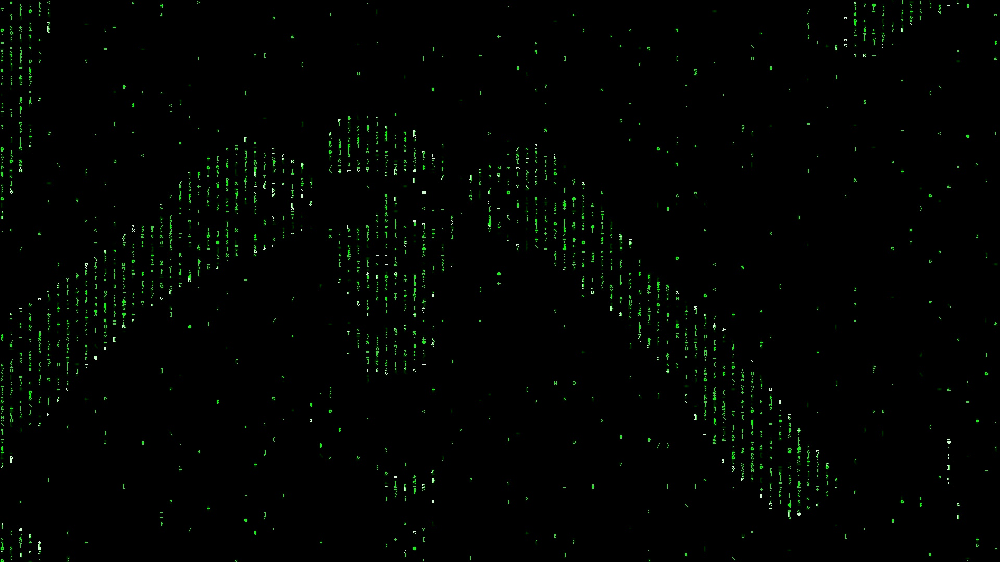

# MatrixCamera
This script enables you to see the world in the eyes of Neo.

It uses OpenCV to create an image from the camera which displays the world in code. 
 
The image below shows an example of the result.


---
## Matrix Text generation
A set of symbols is defined at the beginning as the following:
```python
Symbols = string.ascii_letters + string.digits + string.punctuation*10 + 100*' '
```
For each shown character to display, a character is picked from this set at random. An arbitrary number of lines are pre-generated and for every frame the first line is deleted and a new one is appended at the end. The last line in the list is always displayed on top. By adding new line at the end the effect of the text rolling down is created.

### Treating Spaces a little special
In order to create the effect of randomly partly empty columns, the chances for a space is above already pretty high by adding more of them to the set of characters.

But to create continuous blank parts of a column, every new line checks the previous line for spaces and the gives a chance (at an arbitrary probability) to replace these positions with spaces.  

---
## CV Operations
The following steps are performed for every frame:
* image capture as gray scale
* Otsu threshold to get a binary image with dark and light areas
* Canny edge detection to get a binary image with the edges
* loop trough every character in row-major order
    * calculate the mean of the image area around the current character from the Otsu image
        * if the mean is greater then an arbitrary threshold write the current character in green
    * calculate the mean of the image area around the current character from the Canny image
        * if the mean is greater then an arbitrary threshold write the current character in light green
    * some randomness is introduces by writing the character anyway or not at all at some arbitrary probability

